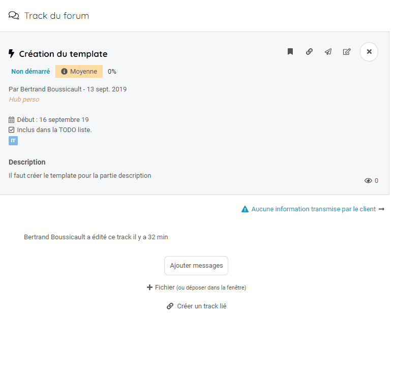

## Creer un track
---------------

Vous avez intégré un projet et vous souhaitez pouvoir communiquer une information, des questions et des idées. 

Pour cela, vous allez devoir créer un track vous permettant de diffuser votre message. Ce track regroupera l'ensemble des informations nécessaires. Description, responsable, Date de début et de fin, tag, etc...

Pour créer un track : 
* Allez sur votre projet
* Accédez au forum
* Cliquez sur le bouton de création de track. 

Un track doit contenir, au minimum, une description afin de pouvoir être ajouté. 

Lors de la création, 4 onglets sont disponibles : 
* Type : Pour pouvoir typer le type d'information que vous souhaitez créer
* Description : pour ajouter un titre, une description et définir le responsable du track
* Tags : Pour ajouter un tag
* Autres : Pour définir une date de début ou de fin ainsi que des options de charges 

Une fois le track créé, il est automatiquement diffusé dans le forum du projet. Il est accessible à l'ensemble des collaborateurs. 

> **Remarque :**
> Créer des tracks est vital pour la bonne santé du projet. Un flux régulier d'information permet de créer et garder une dynamique de travail et de groupe. 
> 

### Créer un fil de track

Une information a de la valeur uniquement si elle est contextualisé. Il est important d'avoir accès au compte-rendu de réunion qui est rattaché à l'action que vous traitez. 

Pour cela, il est possible de lier les tracks entre eux. Ce lien permettra de naviguer entre les différents tracks. 

Pour créer un track lié, positionnez vous sur un track et cliquez sur le bouton "Créer un track lié". 

Vous pouvez aussi lier un track déjà existant.

