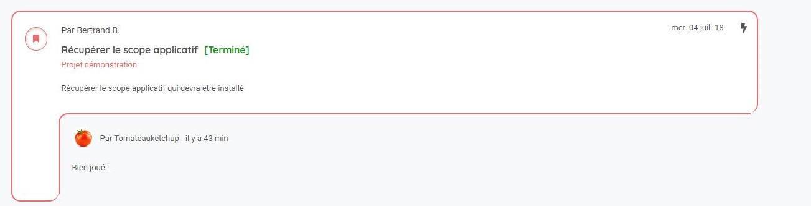

Une news est une notification indiquant qu'une modification a été effectuée sur les tracks de vos projets. 

Elle est générée quand une personne effectue les opérations suivantes : 
* Création d'un track
* Modification d'un track (date, description, responsable...)
* Ajout d'un message dans un track 

> **Points importants :**
> Les opérations effectuées sur les réseaux (ajout, modification, suppression) ne génèrent pas de news. 
> 

## L'accès aux news 

Vous accédez à vos news depuis votre home page en cliquant sur le bouton "News" dans le menu principal ou le menu de navigation rapide. 

## L'interface

Vous trouverez dans l'espace news deux onglets. 

Un onglet pour afficher l'ensemble des news et un onglet pour afficher uniquement les news que vous n'avez pas encore lues. 

Les dernières news sont affichées en haut de la liste. 

Vous trouverez la description du track ainsi que le dernier message ou événement effectué

Vous pouvez indiquer que vous avez lu une news en cliquant sur le bouton "Marqué comme lu". 

> **Astuce :**
> Vous avez aussi la possibilité de mettre toutes les news "non lues" en "lues" en cliquant sur "Tout marquer comme lu". 
> 

### Suivre des tracks

Depuis cet espace, vous pouvez flagger des tracks afin de pouvoir les suivre.

Flagger un track fera apparaitre un liseret rouge autour de celui-ci.

Vous pouvez afficher uniquement les tracks que vous avez flaggés en cliquant sur le raccourci rapide. 

### Le mode compact

Depuis les raccourcis rapide, vous pouvez basculer l'affichage des news en mode compact. 

Ce mode permet d'afficher uniquement le nom du track. 

La description et le dernier message n'apparaissent plus. 

