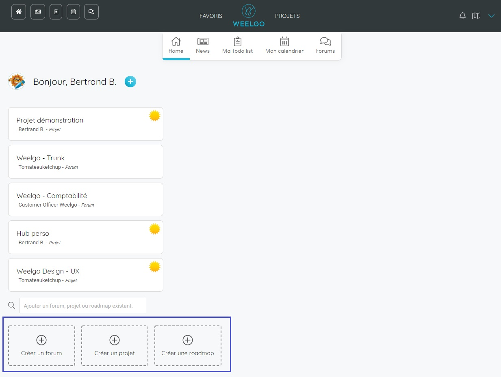

Dans ce tutoriel, nous verrons comme on initialise un projet Weelgo. 

### Etape 1 : Créez votre projet

La création de projet peut s'effectuer depuis votre page principal. 

* Cliquez sur le bouton "Créer un projet" et indiquez un nom pour ce projet. 

> **Point important :**
> Le projet créé sera automatiquement ajouté dans votre page d'accueil ainsi que dans votre todo-list et votre calendrier. 
> 

### Etape 2 : Définissez vos objectifs

### Etape 3 : 

