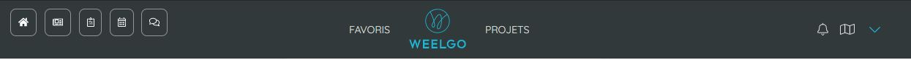

## L'interface de navigation

L'interface de navigation est composé d'un double menu.

Une frise fixe contenant :
* Les raccourcis rapides vers vos outils
* Un accès à vos favoris ainsi qu'au différents projets 
* Un accès au menu de configuration de compte. 

Un menu de navigation contextuel propre à chaque espace. 

Ce menu apparait en Blanc pour indique que vous êtes dans vos espaces personnels et en bleu pour les espaces projets

**Espace personnel : en blanc**

**Espace projet : en bleu**

### L'espace personnel

### L'espace projet

> **Point important :**
> Les opérations effectuées sur les réseaux (ajout, modification, suppression) ne génèrent pas de news. 
> 

