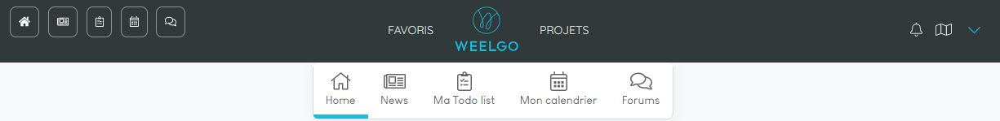
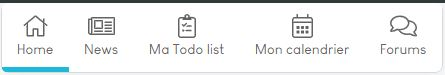
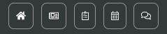
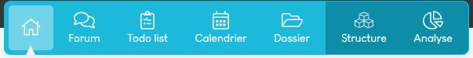
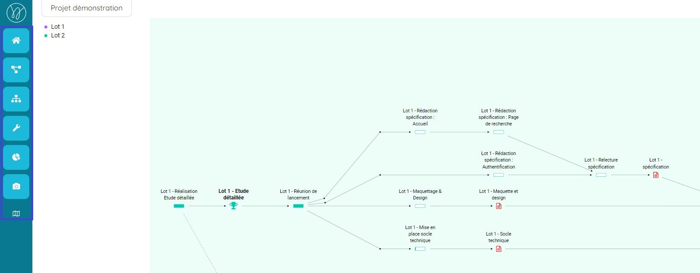
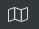

## L'interface de navigation

L'interface de navigation est composé d'un double menu.

**Une frise fixe** contenant :
* Les raccourcis rapides vers vos outils.
* Un accès à vos favoris ainsi qu'au différents projets. 
* Un accès au menu de configuration de compte. 

**Un menu de navigation contextuel** propre à chaque espace. 

### Menu contextuel : espace personnel

Depuis ce menu de navigation vous pouvez accéder aux différents outils qui seront configurés pour afficher les informations des différents projets que vous suivez. 

Vous pouvez accèder à ces espaces depuis toutes l'application en utilisation le menu de raccourcis rapides. 

> **Point important :**
> La todo-list et le calendrier seront filtré sur vous par défaut. 
> 

### Menu contextuel : espace projet

Lorsque vous entrez dans un projet, un menu spécifique au projet apparait. 

#### Le menu du réseau

Sur la partie "réseau" des projets, le menu de navigation s'affiche à gauche. 

Ce menu vous permets de naviguer dans les différents écrans spécifiques à l'espace de pilotage avancé du projet. 

Vous pouvez revenir dans vos espaces personnels en cliquant sur le logo **"Weelgo"** ou dans l'espace projet en cliquant sur sur le bouton **"Home"**.

 **Remarque :** Les espaces projets sont en bleus et les espaces personnels en blancs. 
 

> **Point important :**
> Vous pouvez duppliquer une fenêtre en cliquant sur le raccourcis suivant :  
> 
> Ce raccourcis est présent dans toutes les pages de l'application.
> 

