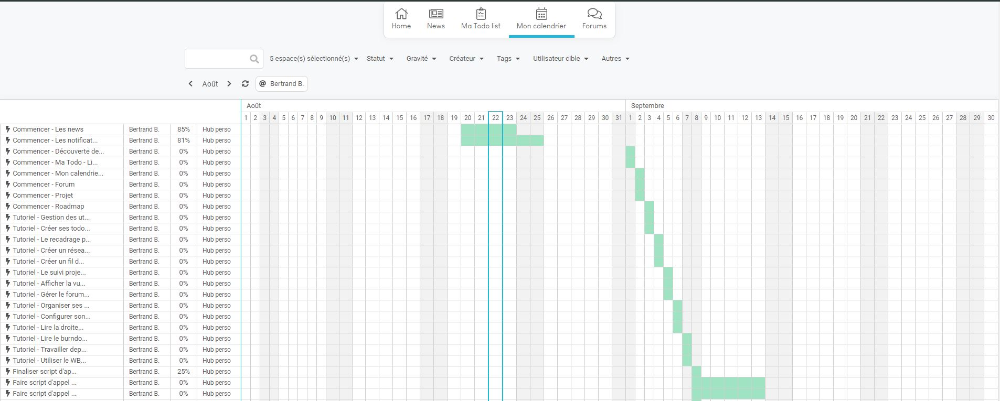
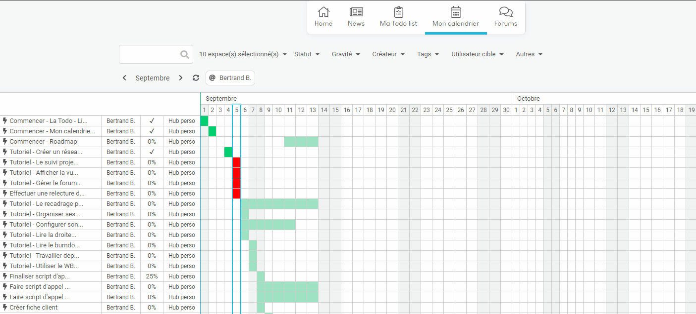
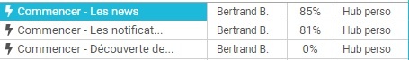

## Le calendrier
---------------

Le calendrier contient l'ensemble des actions positionné dans le temps. 

Comme pour la todo-list, vous pouvez filtrer les actions. 

Depuis le calendrier, vous pouvez modifier les dates de début et les date de fin en cliquant sur une date pour une ligne donnée.

Une fenêtre de choix apparait pour vour permettre de faire la modification. 

Vous pouvez accéder à l'action en cliquant dessus. 

