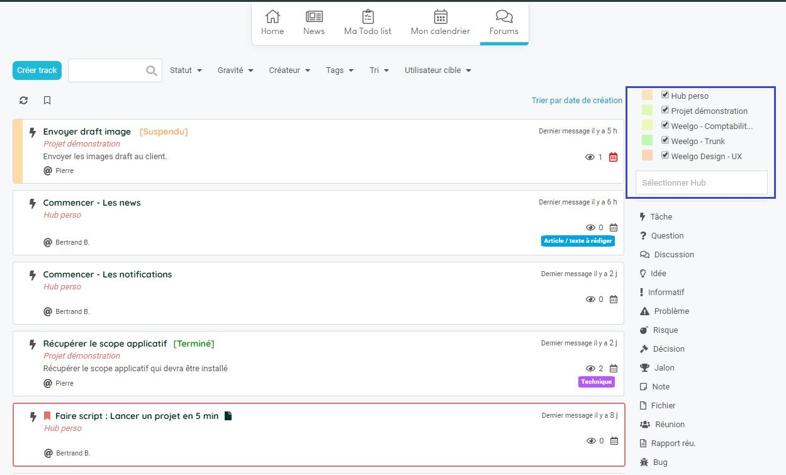
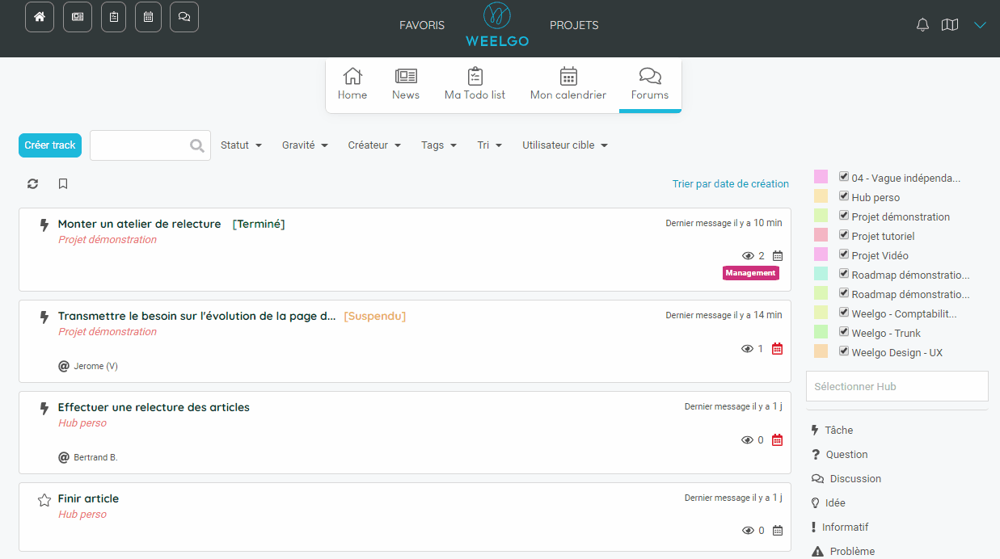
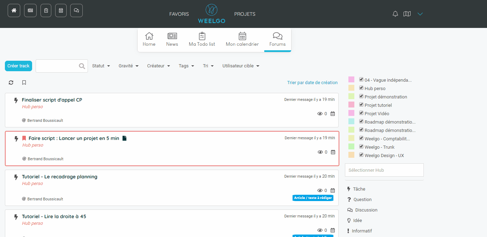
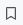

## Le forum
---------------

Dans Weelgo, le forum est l'espace de communication du projet. C'est l'endroit ou l'équipe va pouvoir déposer des idées, des questions et y répondre. 

Des alertes, des risques et des problèmes y seront déclarés. Permettant ainsi à l'ensemble des acteurs de pouvoir être informés en temps réel des événements se déroulant sur le projet.

Le forum contient l'ensemble des tracks des projets sélectionnés

Vous pouvez filtrer sur le type d'information que vous souhaitez en utilsant les filtres rapides à gauche. 

La zone de recherche vous permets de chercher une information rapidement. 

Pour accéder au contenu du track, cliquez dessus. 

> **Astuce :**
> Vous pouvez afficher uniquement les tracks que vous suivez en cliquant sur le bouton 
> 
