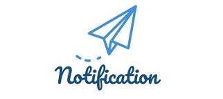
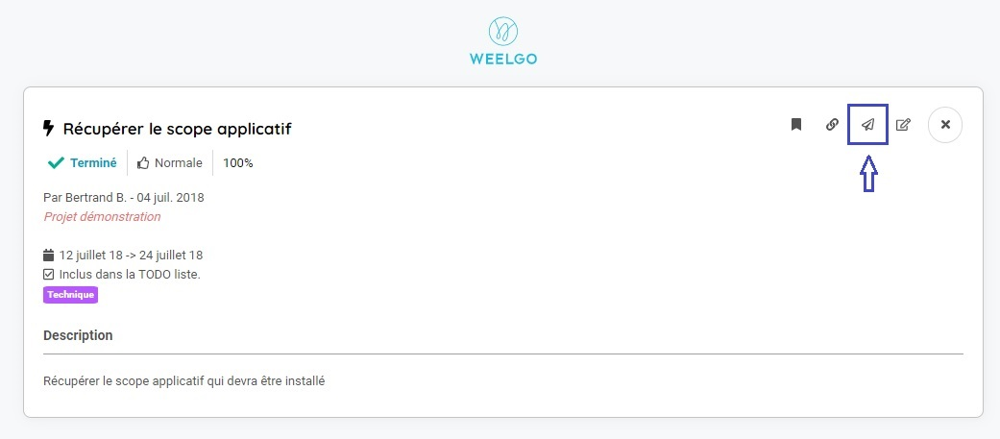
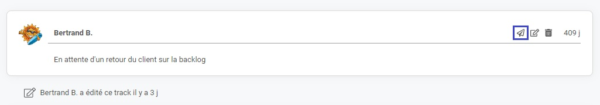
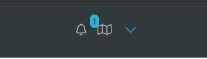
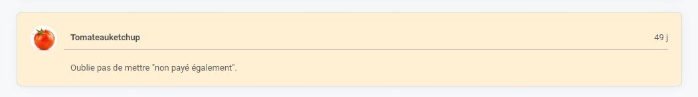

Une notification correspond à un événement qui vous cible particulièrement.  

Elle est générée quand : 
* Un track est créé et que vous êtes indiqué comme étant le responsable du track
* Quand quelqu'un vous cite dans un message 
* Quand quelqu'un utilisation la fonctionnalité "flyer" sur un track

## Comment notifier quelqu'un

### Notifier un track

Vous pouvez notifier un track en cliquant sur l'icone de notification. 

Une fenêtre de saisie de l'utilisateur s'ouvre, vous permettant ainsi de lui recommander de lire le track

### Notifier un message

Vous pouvez aussi envoyer une notification sur un message posté par un collaborateur sur un track. 

> **Point important**
>En fonction de la configuration du compte destinataire, un mail sera généré pour prévenir la personne qu'elle vient de recevoir une notification. 
>

## Comment accéder aux notifications

L'accès au notification s'effectue depuis le menu de raccourci rapide situé en haut à gauche. 

Le nombre de notification, non lues, que vous avez reçu s'affiche à coté de l'icône.

Cliquez sur l'icone, le pannel contenant l'ensemble des notifications s'affichera.

Les notifications non lues s'affichent en bleu. 

Lorsque vous cliquez sur une notification de message, le track s'ouvre et le message apparait en couleur. 

> **Astuce**
>Vous pouvez marquer comme "Lu" toutes les notifications en cliquant sur le bouton "Tout marquer comme lu". 
>
