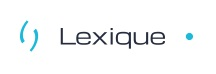

### Track

Un track est conteneur d'informations typé (tâche, question, idée, risque...). 

Il contient une description, un/des responsables, des dates de début ou de fin et il peut être rattaché à un tags. 

Un track sert à diffuser et stocker de l'information. Cette information est partagé à l'ensemble des collaborateurs qui peuvent intéragir sur le track. 

### Notification

Une notification est un signal généré par l'application lorsqu'un track vous est affecté ou lorsqu'un utilisateur vous notifie. 

La notification est très pratique pour pointer un message ou à un track à un collaborateur. 

### Le réseau

Le réseau est l'outil de conceptualisation des projets. 

Un réseau est un enchainement d'actions et de livrables qui permet de modéliser le déroulement logique du projet. Le réseau est la première étape permettant de générer une planification du projet.

### Une Action 

Un action action est un élément du réseau. L'action représente le travail à réalisé. Il contient un titre, un responsable, une charge etc..

Une fois intégré et configuré dans un réseau, l'action apparait dans les todo-list des utilisateurs. 

### Livrable

Le livrable est un élément du réseau. Il correspond au résultat d'une ou plusieurs actions.

Un livrable peut être du type neutre, intermédiaire ou Jalon. Lorsque le livrable est un livrable jalon, il apparait dans les indicateurs de pilotage du projet. 

### Forum

Le fourm est l'espace de communication de Weelgo. Un forum contient l'ensemble des tracks générés par les participants. 

Un forum ne contient pas d'espace de pilotage de projet avancé (réseau, gantt, droit45...)

### Projet

Le projet est un espace de réalisation. Un projet contient un forum ainsi que des outils de pilotage avancé comme le réseau et les indicateurs de pilotage. 

### Roadmap

La roadmap est l'outil de pilotage haut niveau de Weelgo. Une roadmap contient des phases et des jalons macroscopique ainsi que des outils de consolidation et de comparaison de roadmap. 

Une roadmap peut être branché à un projet/forum pour récupérer de l'information en direct sur l'avancement des opérations. 

### Utilisateur virtuel

Un utilisateur virtuel est ou utilisateur créé par le responsable du projet. Cet utilisateur à les même caratéristiques qu'un utilisateur normal.

Il est rattaché au projet. 

L'utilisateur virutel est pratique pour utiliser Weelgo en solo ou pour simuler un utilisateur. 

Vous pouvez gérer les utilisateurs virtuel du projet depuis son espace de partage 

