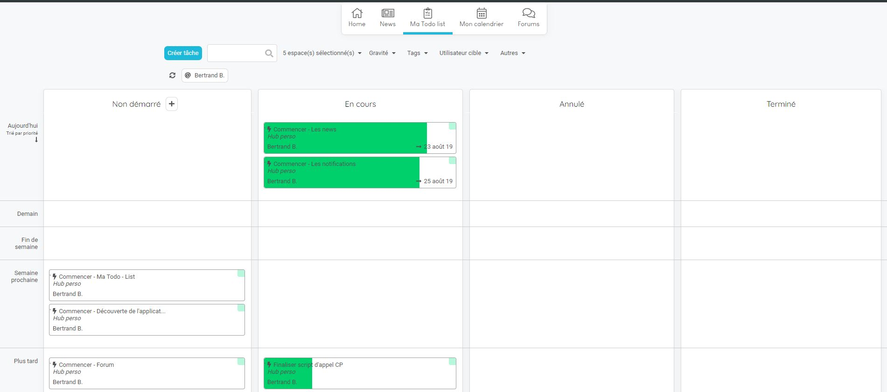
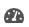
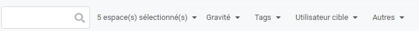
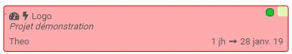
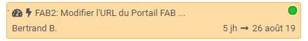
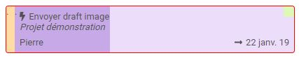
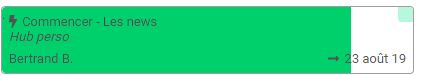
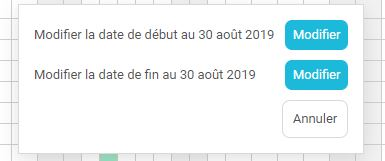
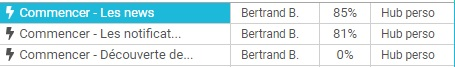

# La todo-list

La todo-list est un outil contenant les actions des forums et réseaux de vos projets. 

Par défaut, elle est filtrée sur votre nom. 

Elle est multi-projet et affiche l'ensemble des actions des projets séléctionnés

> **Point important :**
> Les actions contenant l'icône  sont des actions provenant du réseau du projet. Il est impossible de modifier la date de début et la date de fin de ce type d'action depuis la todo-list
> 

Vous pouvez filtrer la todo-list en utilisant le menu prévu à cet effet. 

Une fois un filtre ajouté, il s'affiche en dessous du menu. Vous pouvez supprimer le filtre en cliquant dessus. 

> **Remarque :**
> Lorsque vous créez un nouveau projet, il est automatiquement ajouté à la liste des projets de la todo-list. 
> 

### Organisation et code couleur des tickets

Les tickets sont ordonnancés du plus récent au plus ancien en fonction des dates de débuts renseignées. 

Lorsqu'un ticket est en retard, il apparaît en couleur. 

Le code couleur est le suivant. 

**Rouge :**

* Action issue du réseau : Le reste à faire de l'action génère un retard qui entraine un retard sur le jalon de fin du projet

* Action issue du forum : La date du jour est supérieure à la date de fin.

**Orange :** Concerne uniquement les action issues d'un réseau

L'action est en retard est la date de fin recalculée impacte le planning du projet sans impacter la date de fin du dernier jalons. 

**Violet :** 

* L'action est suspendue 

**Vert / blanc :** 

* L'action est dans les temps et aucun retard n'est à déplorer. 

## Le calendrier

Le calendrier contient l'ensemble des actions positionné dans le temps. 

Comme pour la todo-list, vous pouvez filtrer les actions. 

Depuis le calendrier, vous pouvez modifier les dates de début et les date de fin en cliquant sur une date pour une ligne donnée.

Une fenêtre de choix apparait pour vour permettre de faire la modification. 

Vous pouvez accéder à l'action en cliquant dessus. 

