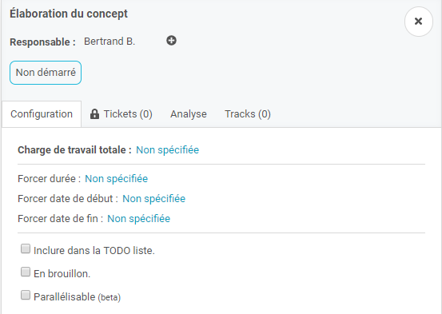
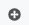
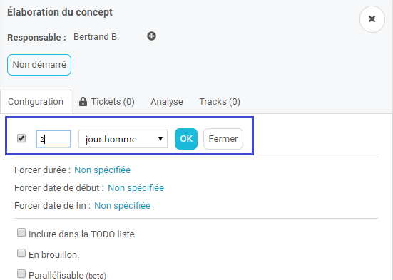
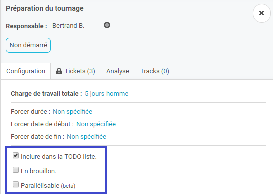
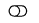
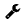
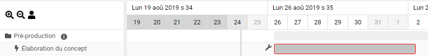
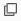
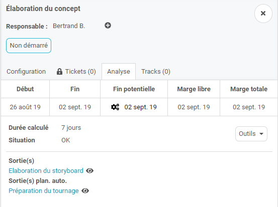

Vous avez initialisé un réseau d'actions et vous devez maintenant les configurer pour finaliser votre réseau. 

La configuration par défaut est la suivante : 

### Affectation de l'action et des charges

Le responsable par défaut est le responsable du projet ou du repertoire de l'action. 

L'affectation des responsables permet de transmettre la responsabilité de l'action à un collaborateur. 

Pour cela, trouvez votre collaborateur depuis le bouton  et cherchez le depuis la recherche. 

---
 
**Nos préconisations :**
>*Affectez un responsable unique à une action.*
 

**Tips&Astuces :**
>*Si l'action contient plusieurs responsables, nous considérons que l'action sera réalisée par l'ensemble des collaborateurs en même temps (en fonction de leurs disponibilités). La charge de réalisation sera alors distribuée entre tous les responsables.* 

---

### Renseignez des charges de réalisation

Lors de cette étape, vous devez indiquer la charge de réalisation des actions et des tickets.

Attention à ne pas confondre la durée de réalisation d'une action et la charge de réalisation de l'action

La charge de réalisation correspond au temps nécessaire de réalisation de l'action. La durée de réalisation correspond au temps que prendra la réalisation de la charge de l'action. 

Exemple : 

Une action de 5 jh peut etre réalisée en 10 J. 
Charge de réalisation : 5 jh
Durée de réalisation : 10J

**Une action / ticket peut être plannifié(e) uniquement si une charge de réalisation est renseignée.** 

L'affectation des charges des actions s'effectuent en cliquant sur l'action.

L'affectation des charges des tickets s'effectuent depuis l'onglet "Ticket" des actions. 

---

**Nos préconisations :**
 
>*Demandez aux responsables d'actions / tickets de renseigner la charge de réalisation. Cela permettra d'avoir une planification réaliste ainsi que de responsabiliser les acteurs à la réalisation du projet.* 

>*De plus vous donnerez l'opportunité de communiquer sur le réseau de réalisation du projet et ainsi faire des ajustements si nécessaire.*

>*Ne confondez pas la charge de réalisation et la durée de réalisation. Lors de la saisie de la charge de réalisation, ne prenez pas en compte les hypothèses de productivité. Ces hypothèses seront gérées au niveau du planning des collaborateurs*

---

### Les options de date de début et date de fin

Sur l'action, vous avez la possibilité de définir une date de début et/ou une date de fin. Cela permet de positionné manuellement l'action sur une date fixe.

Quand vous définissez une date sur une action, cette action est parallélisée et ne beneficie plus de la linéarisation des charges. 

---

**Nos préconisations :**
>*Utilisez l'ajout de date sur les actions de début de réseau et laissez Weelgo générer une planification.* 

>*Evitez au maximum l'utilisation des dates pour profiter pleinement de la planification automatique.*

---

### Les options supplémentaires

**Inclure dans la todo-list :** Cette option permet d'afficher dans la todo-list du responsable l'action. Par défaut, elle n'est pas cochée pour ne pas perturber les todo-list avec des actions non finalisées.
Les actions non inclues dans les todo-list arbore le symbole 

**En brouillon :** Permet d'indiquer que l'action n'est pas finalisée. Une cléf apparait sur le réseau  et l'action est grisée au niveau du gantt

**Parallélisable :** Cette option permet à l'action d'être paralléle aux autres actions. Cela est utile pour pouvoir ajuster une planification sur des actions ayant le même responsable et dont sa capacité lui permet de réaliser deux actions en même temps. 
Le symbole  dans le gantt indique que l'action est parralélisée. 

### L'analyse

Une fois l'action configurée et chargée, vous retrouvez dans l'onglet "analyse" les différentes informations de l'action. 

