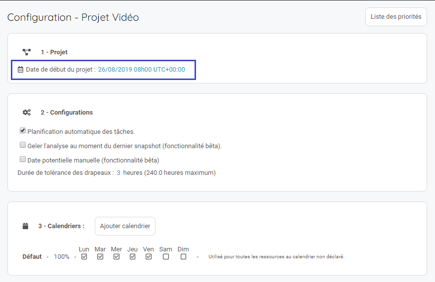

## Configurez le projet
------------------------

Abordons maintenant la configuration du projet et la mise en place des hypothèse de départ. 

### Définition de la date de début du projet
------------------------

Avant de vous lancez dans l'analyse du planning de votre projet, il est nécessaire de définir la date de début du projet. La première action de votre réseau commencera à cette date. 

---

**Remarque :**
>L'UTC correspond à la l'UTC de la date renseignée et non à l'UTC du projet. Si votre projet change d'UTC pendant sa réalisation, ne touchez pas à ce paramètre. 

---

### Définition des options du projet
------------------------

La configuration par défaut correspond à l'image ci-dessus. Nous vous conseillons de ne pas modifier cette configuration. 

La désactivation de la planification automatique vous obligera à linéariser vous-même le plan de charge de vos collaborateurs.

L'option d'activation de la date potentielle manuel désactivera le calcul des dates potentiels de l'application. Seules les dates renseignées par les utilisateurs seront prises en compte dans l'affichage des dates potentielles. 

### Définition du calendrier des collaborateurs
------------------------

Sur Weelgo les ressources sont uniquement des collaborateurs. La gestion des collaborateurs s'effectue en gérant leurs calendriers. 

Ajoutez les calendriers de vos collaborateurs et definissez des dates spécifiques. 

Une fois la disponibilité renseignée, elle est automatiquement prise en compte dans la construction du planning du projet. 

Pour définir une plage sur un calendrier, cliquez sur 2 dates. Une fenêtre vous permettra de définir la disponibilité du collaborateur sur la période. 

---

**Nos préconisations :**

>N'affectez pas vos collaborateurs à 100%. Prenez une marge, cela permettra d'avoir une gestion de projet plus souple et vous permettre d'absorber plus facilement les aléas de la vie du projet.

**Tips&Astuces :**
>La modification du calendrier ou de la productivité générale de la personne impactera le planning depuis le début du projet. Afin de ne pas modifier le planning déjà réalisé, modifiez la charge à venir du collaborateur en ajoutant des dates spécifiques.

---
