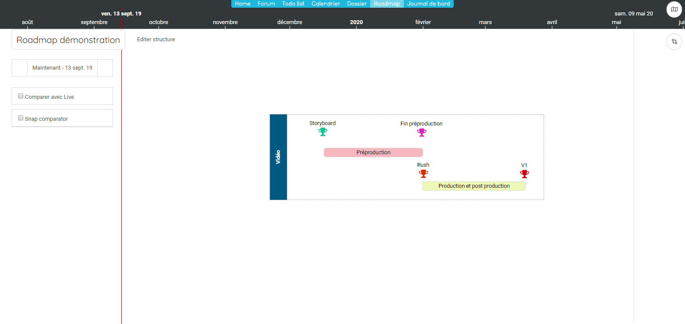
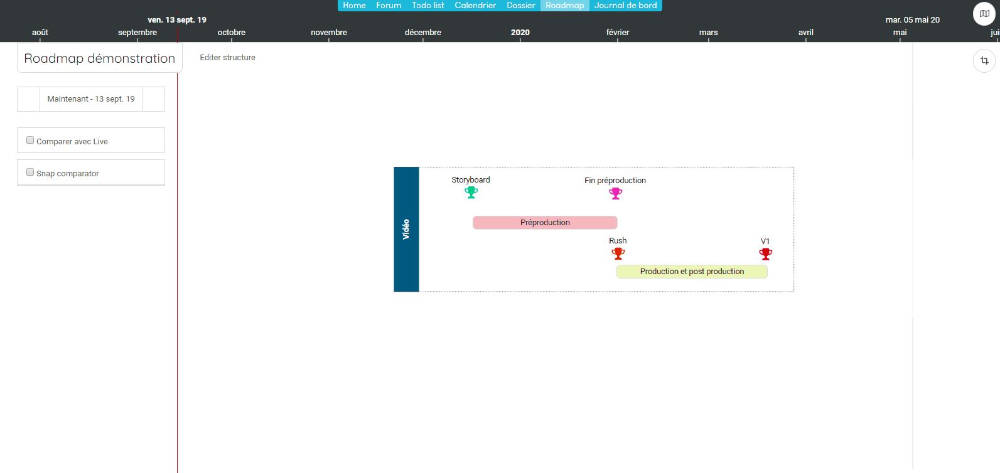

## Connectez votre roadmap
------------------------

Vous avez intialisé une roadmap et vous avez des projes opérationnels que vous souhaitez rattacher à votre roadmap afin de pouvoir accentuer le suivi et la maitrise des plannings projets. 

Réaliser une connection entre une roadmap et un réseau vous permettra : 
* de récupérer automatiquement l'information provenant des réseaux 
* d'avoir une visibilité en temps réel de la bonne tenue des objectifs

Pour créer un lien avec un projet, vous devez avoir les autorisations en lecture sur ce projet. 

Une fois que vous avez accès au projet, vous allez pouvoir ajouter le lien entre l'item (phase ou jalon) et un item du projet (actions/jalons/tracks). 

Une fois le lien ajouté, vous avez accès à l'information directement depuis la roadmap. Pour cela, vous devez activer le mode "live". 

Ce mode live remontera les informations qui sont directement issues du réseau. Vous verrez ainsi si une phase ou un jalon est en train de dériver ou si il prend de l'avance. 

**Remarque :**
>*Quand l'item n'est pas branché à un un réseau. L'indication "Pas de collecteur" apparait en mode live*

---

### Récupérer l'information du réseau
------------------------

Vous avez branché votre roadmap et vous souhaitez maintenant récupérer et intégrer l'information provenant du réseau. 

Pour cela, activez le mode live puis cliquez sur l'action. Depuis le paneau, vous pouvez intégrer l'information dans votre roadmap.

