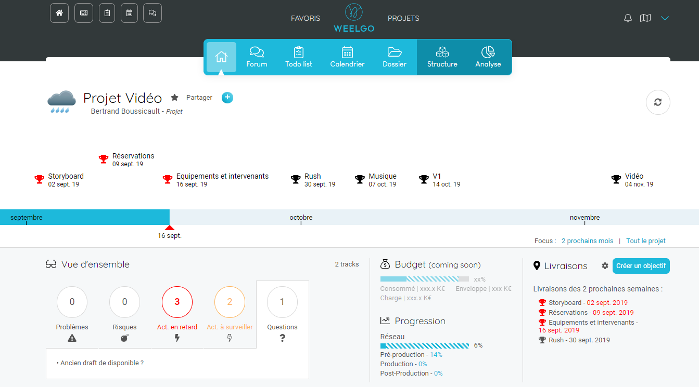
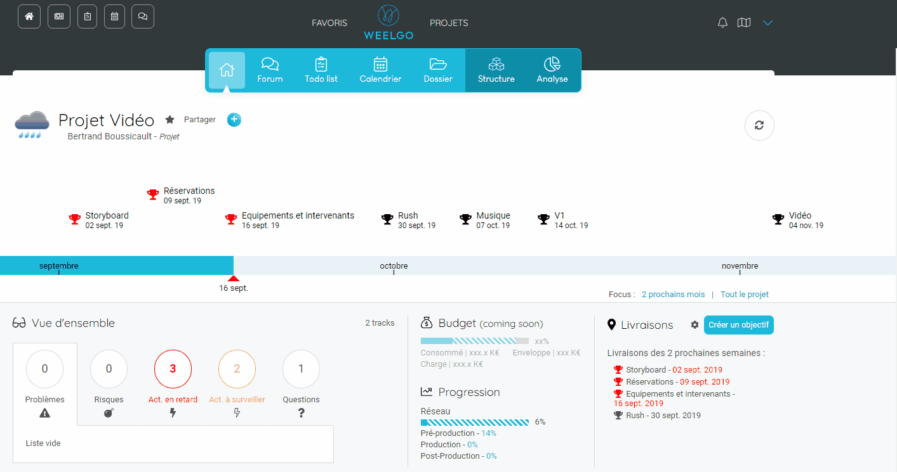
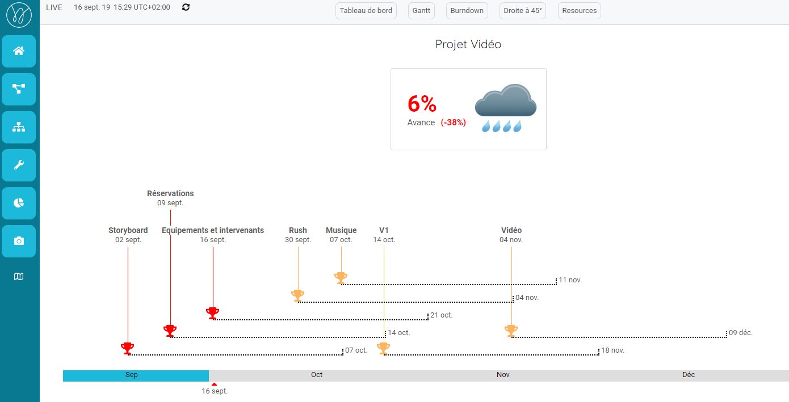
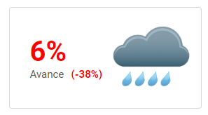
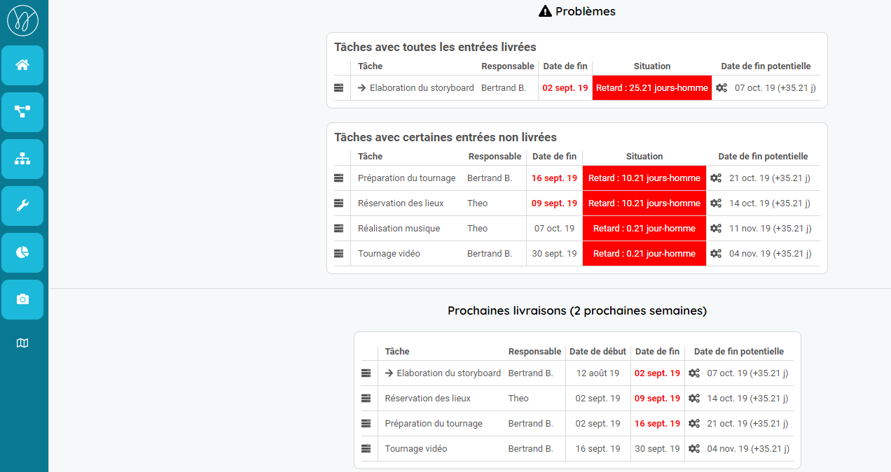
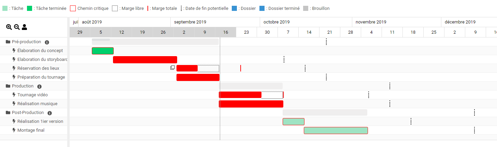
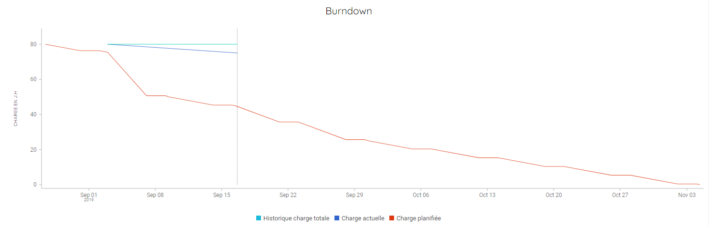
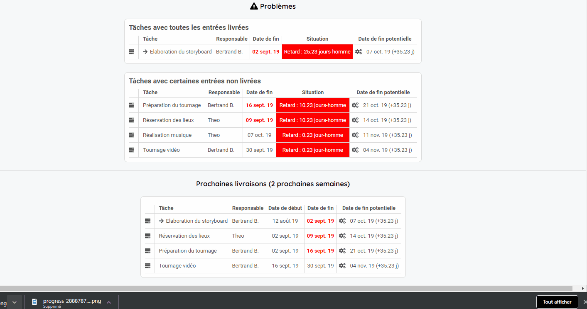
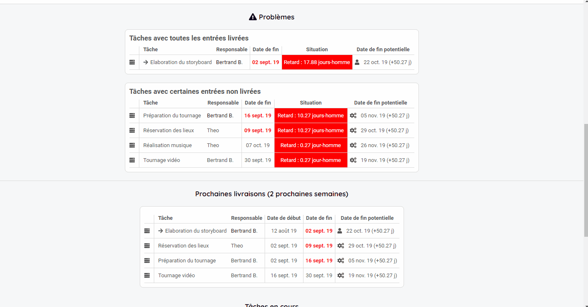

## Suivez et pilotez vos projets
------------------------

Vous avez créé votre projet et votre équipe commence à réaliser le travail. 

Il est temps de suivre l'évolution des opérations !

En plus d'être un outil de planification efficace, Weelgo permet de suivre finement le déroulement des projets grace aux différentes vues de pilotage projet.
* Home page du projet
* Dashboard
* Gantt
* Droite à 45
* Burndown

C'est au travers ces vues que vous allez pouvoir identifier les problèmes et pouvoir intervenir rapidement afin de maitriser le timing. 

### La home page du projet. 

La première vue vous indiquant la tendance du projet est la home page du projet. En effet, depuis cette vue vous avez une première vue 360.

La timeline indiquera en rouge les jalons en retard et en vert les jalons terminées ainsi que les points importants à suivre ou à traiter. 

Vous avez aussi un récapitulatif des points important à suivre ou à traiter.

Depuis cette vue, vous pouvez déjà répondre aux questions et intéragir sur ces points chauds. 

### Le dashboard de pilotage

La home page est intéressante pour avoir une vision rapide. Néanmoins ce sont les outils d'analyse qui vous permettront de piloter votre projet. 

Vous trouverez ces outils dans l'onglet "Analyse". 

Allons immédiatemnt sur le dashboard du projet. 

Nous trouvons la timeline de la home page avec plus de détail avec les dates de fin potentielles apparaissant en pointillées. 

Vous avez aussi un indicateur de progression macroscopique.

Ici il vous indique que le projet à 6 % d'avancement est il est en retard de 36 %.

En dessous de la timeline, la liste des actions problématiques. Les actions dont la date de fin apparait en rouge sont des actions dont la date de fin est située avant la date du jour.

La section des "Problèmes" contient deux tableaux : 
* Tâches avec toutes les entrées livrées : Ce sont les actions qui n'ont pas de prérequis. Elles n'ont aucune raison apparente ni logique de ne pas être réalisées. 
* Tâches avec certaines entrées non livrées : Ce sont des actions qui sont en dépendances avec des actions en retards. 

Il est important de faire la distinction entre les deux tableaux. En effet, vous ne pouvez pas reprocher à un collaborateur d'être en retard s'il était impossible de réaliser son action car elle dépendait d'une action non terminée. 

Lors du pilotage de votre projet, vous allez vous focaliser principalement sur les tâches avec toutes les entrée livrées. Ce sont elles qui sont à l'origine des autres retards. 

### Le gantt et burndown

Vous avez aussi accès au gantt et au burndown du projet. 

Le gantt vous indiquera la vue planning du projet. Vous retrouverez les actions en retard (en rouge) ainsi que les actions terminées (en vert).

Le burndown vous donnera la tendance de votre projet. 

La courbe rouge indique la charge planifiée. C'est l'objectif. 

La courbe bleue, la charge actuelle. Votre "consommation". 

La courbe verte, l'historique de la charge du projet. 

Ici nous voyons : 
* que la charge du projet est stable
* que le projet ne consomme pas suffisament. Il est donc très en retard. 
* nous remarquons aussi que la pente est régulière après le 7 septembre. Aucun "coup de chaud" à l'horizon (hormis le retard en cours). 

### Ajoutez des messages. 

Face à une situation de ce genre. Vous allez obligatoirement déclancher une réunion afin de pouvoir recadrer le projet. 

Vous pouvez aussi ajouter des messages dans les actions afin de récupérer de l'informatio. 

### Recadrer le projet. 

Vous avez réalisé votre réunion ou vous avez récupéré l'information concernant la nouvelle date de fin visée par le responsable de l'action en retard. 

Vous pouvez alors recadrer le projet. Pour cela, vous trouverez, dans l'action, un outil vous permettant de recadrer automatiquement l'ensemble. 

Lors du recadrage planning, l'outil vous demandera la nouvelle date visée. Vous verrez les impacts jalons associés.

Si vous acceptez la date, alors l'ensemble du projet sera impacté. 

L'action et l'ensemble du projet sont recadrés. 

Vous pouvez maintenant prendre un snapshot afin d'historiser la modification. 

**Bonne pratique :**
>*Il est important de ne pas laisser des actions en retard. Une action dont la date de fin est inférieure à la date du jour doit être recadrée.*

