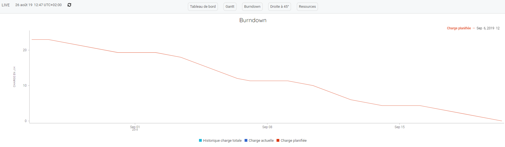
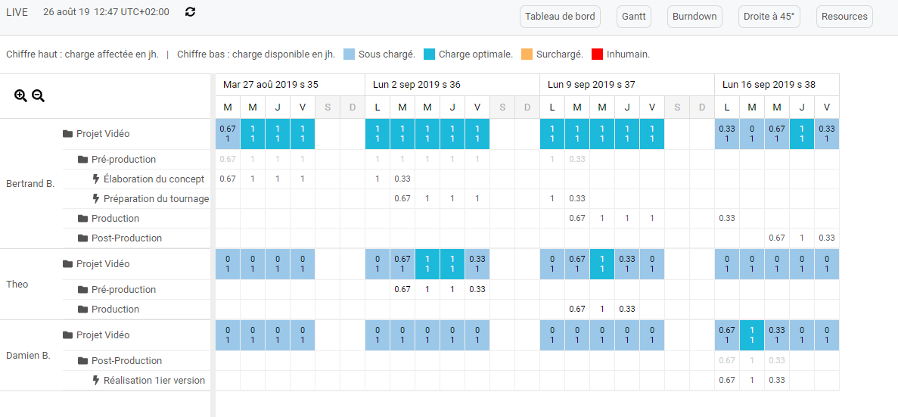

## TP : Créez un projet
------------------------

Dans ce travaux pratique, nous allons voir les différentes étapes pour créer le projet suivant :

**Le réseau**

**Le dashboard**

**Le gantt**

**Le burdown**

**Le plan de charge**

### Etape 1 : Créez le projet
------------------------

Allez sur votre page d'accueil et cliquer sur le bouton.

Indiquez un nom et cliquez sur "OK"

### Etape 2 : Créer le réseau
------------------------

Allez sur le réseau en cliquant sur le bouton "Réseau"

La page vierge du réseau s'affiche. Pour ajouter des actions, cliquez sur le bouton "Editer" 

Le panel contenant les outils d'édition s'affiche.

#### Ajout d'une action et d'un livrable

Faites un click droit sur l'espace de travail et cliquez sur "Créer action". 

L'action apparait. Renommez la :
* click droit sur l'action.
* renommer.

Nous allons maintenant associé un livrable à l'action: 
* click droit sur l'action.
* Créer livrable.

Vous devez avoir le résultat suivant. 

Renommez ensuite le livrable : 
* click droit sur le livrable.
* renommer.

Continuer à créer les actions et livrables pour obtenir le réseau suivant : 

Vous pouvez déplacer les actions et livrables sur l'espace de travail :
* maintenez le click gauche sur l'item et déplacez le.

---
**Points importants :**

>*Toutes les opérations de création d'actions et livrables sont accessibles depuis le click droit de la souris et le menu contextuel associé

---

#### Créez les repertoires et associez les actions/livrables

Vous avez créé le réseau, nous allons maintenant créer les répertoires : 
* Cliquez sur le bouton "+" 

* Saisissez le nom du répertoire
* Recommencez pour créer l'arborescence suivante 

Une fois les repertoires ajoutés, associez les actions/livrables : 
* Selectionnez les actions et livrable en maintenant le click droit sur l'espace de travail et séléctionnez les actions et livrables. 

* Une fois les actions séléctionnées, faites un click droit (maintenir) et dirigez la souris vers le répertoire. Une flèche va apparaitre. 

* acceptez l'association. 

Effectuer les même opération pour les répertoires : 
* Post-production
* Production

---

**Nos préconisations :**
 
>*Le réseau doit être structuré par des actions fournissant des livrables clés. Une action n'aboutissant pas à un livrable de haute importance doit plutôt être traitée comme un ticket (depuis la vue Organisation).*

**Points importants :**

>*Une action doit forcement aboutir à un livrable ou plusieurs livrables. Une action n'aboutissant à aucun résultat (livrable) ne doit pas être présente dans le réseau.*

---
