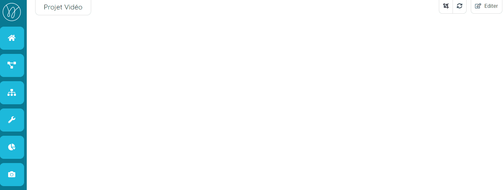
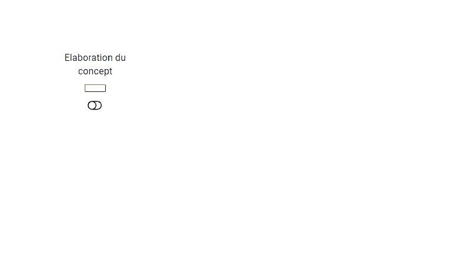
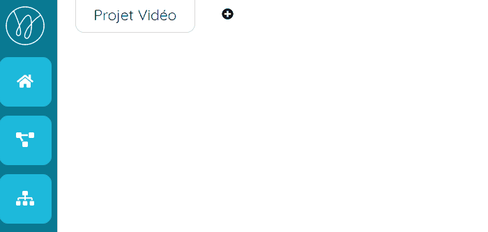
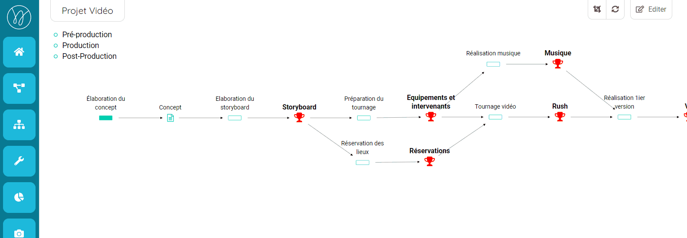
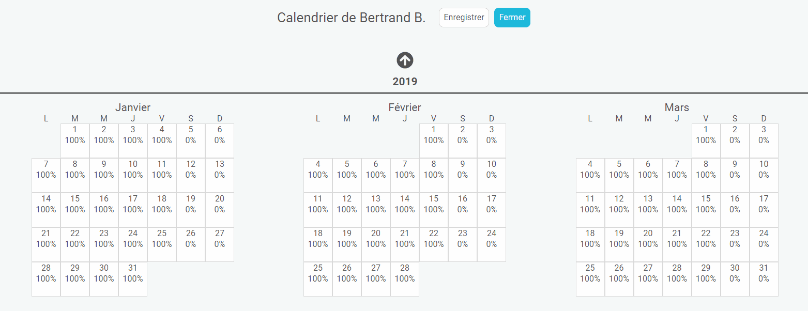
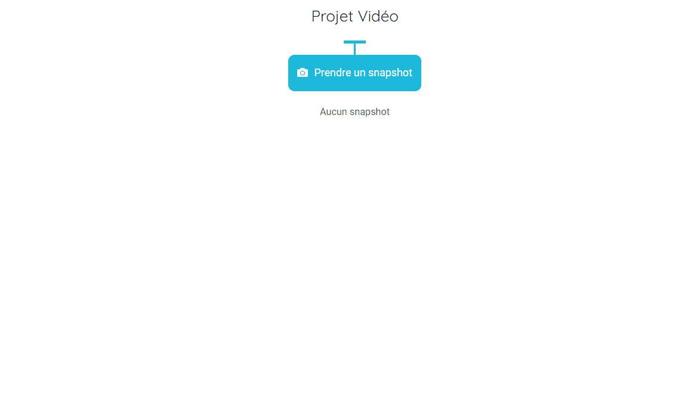
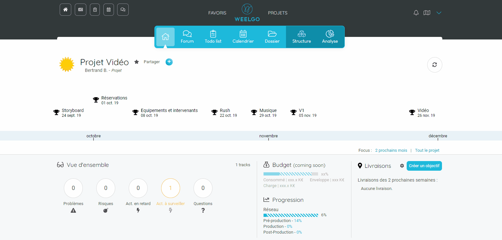

## Workshop : Créez un projet
------------------------

Chaque équipe utilise Weelgo différemment pour gérer ses projets. Toutefois, certaines opérations sont les mêmes pour toutes les équipes.

Dans ce workshop, nous allons voir les différentes étapes pour créer le projet suivant :

**Le réseau**

et les indicateurs de pilotage associé :

**Le dashboard**

**Le gantt**

### Etape 1 : Créez le projet
------------------------

Allez sur votre page d'accueil et cliquer sur le bouton.

Indiquez un nom et cliquez sur "OK"

### Etape 2 : Créer le réseau
------------------------

* Allez sur le réseau en cliquant sur le bouton "Réseau"

#### Ajout d'une action 

* Cliquez sur le bouton "Editer" pour ajouter des actions. Un panel contenant les outils d'édition s'affiche.
* Faites un click droit sur l'espace de travail et cliquez sur "Créer action" puis renommez-la.

#### Ajout d'un livrable

Nous allons maintenant associé un livrable à l'action: 
* click droit sur l'action.
* Créez livrable puis renommez-le.

---
**Points importants :**

>*Vous pouvez modifier le type de livrable (neutre, intermédiaire, jalon). Les livrables jalons apparaitront sous forme de coupe. Ils seront affichés dans le dashboard et dans la droite à 45° ainsi que dans la home page du projet.*

---

Continuer à créer les actions et livrables pour obtenir le réseau suivant : 

Pour déplacer les actions et livrables sur l'espace de travail, maintenez le click gauche sur l'item et déplacez les.

#### Créez les repertoires et associez les actions/livrables

Vous avez créé le réseau, nous allons maintenant créer les répertoires : 
* Mettez vous en mode édition
* Cliquez sur le bouton "+" 
* Saisissez le nom du répertoire
* Recommencez pour créer les répertoires restants

Une fois les repertoires ajoutés, associez les actions/livrables : 
* Selectionnez les actions et livrable en maintenant le click droit sur l'espace de travail et séléctionnez les actions et livrables. 
* Une fois les actions séléctionnées, faites un click droit (maintenir) et dirigé la souris vers le répertoire. 
* acceptez l'association. 

Effectuer les même opération pour les actions restantes. Distribué les dans les autres répertoires. 

### Etape 3 : Configurez les actions
------------------------

Le réseau est initialisé, nous allons maintenant configurer les actions. 

Faites un double click gauche sur la première action. Un panel s'ouvre. 

Dans ce panel, vous pouvez configurer la charge de travail, le responsable, la durée...

Ajouter une charge de travail de 5 jours-homme. 

Cliquer sur le bouton "+" pour modifier le responsable de l'action

Renseignez le nom du responsable. S'il n'est pas dans Weelgo, l'application vous proposera de créer un utilisateur virtuel.

Vous venez d'initaliser votre première action. 

Continuez à initialiser les autres actions. 

---

**Points importants :**

>*Le responsable par défaut et le responsable du projet ou du répertoire de l'action.* 

>*Les utilisateurs virtuels sont associés au projet. Lors de la création de l'utilisateur, vous pouvez re-utiliser un utilsateur virtuel d'un projet dont vous avez la visibilté.* 

---

### Etape 4 : Configurez le projet. 
------------------------

Cliquez sur l'icone .

La page du projet s'affiche. Effectuez les opérations suivantes : 
* Renseignez alors la date de début du projet. 
* Ajoutez les calendriers de vos ressources. 

Pour chaque ressource, définissez :
* le taux de productivité 
* son calendrier en cliquant sur "Ajouter des dates spécifiques"

Quand vous ajoutez des dates spécifiques, le calendrier s'affiche. Vous pouvez alors modifier plus finemenet la productivité en cliquant sur les dates du calendrier. 

---

**Tips&Astuces :**
>*Pour modifier une plage, cliquez sur une date puis sur une deuxème date. Une fenêtre s'affichera vous permettant de modifier la plage entre les deux dates.*

---

### Etape 6 : Effectuez un premier snapshots. 
------------------------

Vous venez d'initialiser votre projet. Vous devez maintenant effectuez un snapshot du projet pour avoir une capture du projet à son début. 

Pour cela, cliquez sur le bouton  puis sur "Prendre un snapshot". 

Le snapshot est alors enregistré et disponible. 

---

**Tips&Astuces :**
>*Pensez à prendre un snapshot du projet régulièrement afin de consolider les indicateurs de pilotage du projet. 

---

### Etape 7 : Partagez le projet à vos collaborateurs
------------------------

Il ne reste plus qu'a partager le projet à vos collaborateurs. Pour cela, aller sur la page principal du projet et cliquez sur le bouton "Partager". 

La page de partage s'ouvre et vous pouvez ajouter vos collaborateurs et configurez les droits. Pour cette partie, je vous invite à lire le tutoriel [ici](http://docs.weelgo.com/fr/tutoriels/partagez_projet/)

