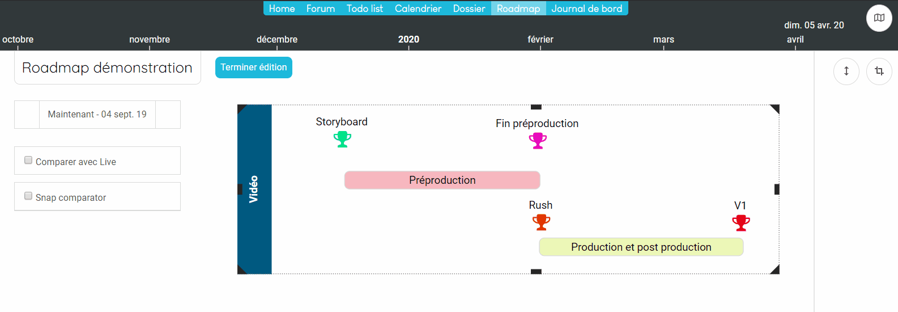

## Workshop : Créer une roadmap
------------------------

Dans ce workshop, nous allons voir les différentes étapes pour créer la roadmap suivante :

### Etape 1 : Créez le projet de type Roadmap
------------------------

Allez sur votre page d'accueil et cliquer sur le bouton.

Indiquez un nom et cliquez sur "OK"

### Etape 2 : Créer la roadmap
------------------------

Allez dans l'espace que vous venez de créer et cliquez sur 

Maintenant vous allez éditer la structure pour créer les jalons et les phases

**Création des phases**

**Création des jalons**

**Ajout du groupe**

Nous allons mainteant ajouter le groupe "Vidéo". 

**Modification du style**

Vous pouvez modifier la couleur et le style des items en allant dant l'onglet style

Repositionnez les éléments et modifiez leurs couleurs. 

---
**Tips&Astuces:**

>*Vous pouvez bloquer le déplacement horizontal des ietems en cliquant sur le bouton .*

---

**Prendre le premier snapshot**

Votre roadmap est initialisé, vous devez prendre votre premier snapshot afin de pouvoir sauvegarder cet état initial. 

Pour cela, allez dans le Journal de bord et cliquez sur 

#### Ajoutez un faits. 

Afin de faire vivre votre roadmap, vous pouvez ajouter des faits sur les jalons et les phases. 

Les faits sont de l'information que vous allez rattacher à votre roadmap. Ils apparaitront dans le journal de bord lorsque vous ferez des snapshots. 

