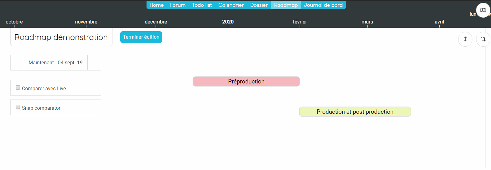
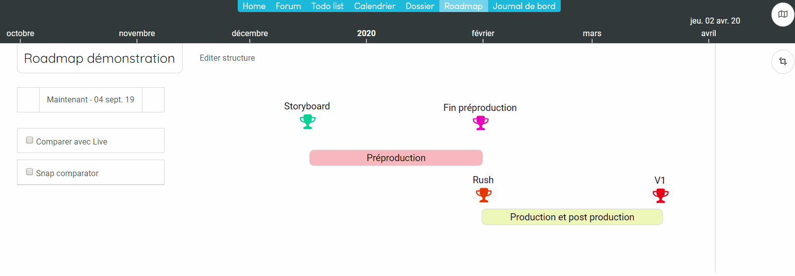

## Workshop : Créer une roadmap
------------------------

Dans ce workshop, nous allons voir les différentes étapes pour créer la roadmap suivante :

### Etape 1 : Créez le projet de type Roadmap
------------------------

Allez sur votre page d'accueil et cliquer sur le bouton.

Indiquez un nom et cliquez sur "OK"

### Etape 2 : Créer la roadmap
------------------------

Allez dans l'espace que vous venez de créer et cliquez sur 

Maintenant vous allez éditer la structure et créer les phases du projets. 

Ajoutons maintenant les jalons. 

Nous allons mainteant ajouter le groupe "Vidéo". 

Vous pouvez modifier la couleur des items en allant dant l'onglet style

Repositionnez les éléments et modifiez leurs couleurs. 

---
**Tips&Astuces:**

>*Vous pouvez bloquer le déplacement horizontal des ietems en cliquant sur le bouton .*
---

**Prendre le premier snapshot**

Votre roadmap est initialisé, vous devez prendre votre premier snapshot afin de pouvoir sauvegarder cet état initial. 

Pour cela, allez dans le Journal de bord et cliquez sur 

#### Ajoutez un faits. 

Votre roadmap va vivre et vous devez pouvoir intégrer de l'information dans les différent

#### Prendre des snapshots. 

Faites un click droit sur l'espace de travail et cliquez sur "Créer action". 

L'action apparait. Renommez la :
* click droit sur l'action.
* renommer.

Nous allons maintenant associé un livrable à l'action: 
* click droit sur l'action.
* Créer livrable.

Vous devez avoir le résultat suivant. 

Renommez ensuite le livrable : 
* click droit sur le livrable.
* renommer.

---
**Points importants :**

>*Vous pouvez modifier le type de livrable (neutre, intermédiaire, jalon). Les livrables jalons apparaitront sous forme de coupe. Ils seront affichés dans le dashboard et dans la droite à 45° ainsi que dans la home page du projet.*

---

Continuer à créer les actions et livrables pour obtenir le réseau suivant : 

Pour déplacer les actions et livrables sur l'espace de travail, maintenez le click gauche sur l'item et déplacez les.

