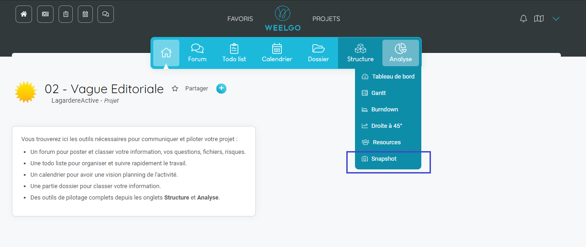
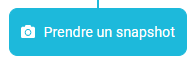
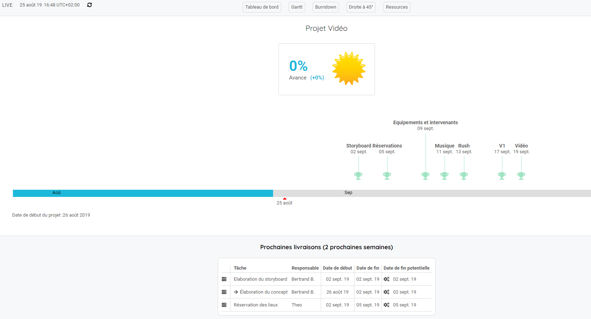
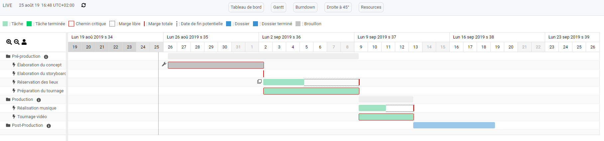
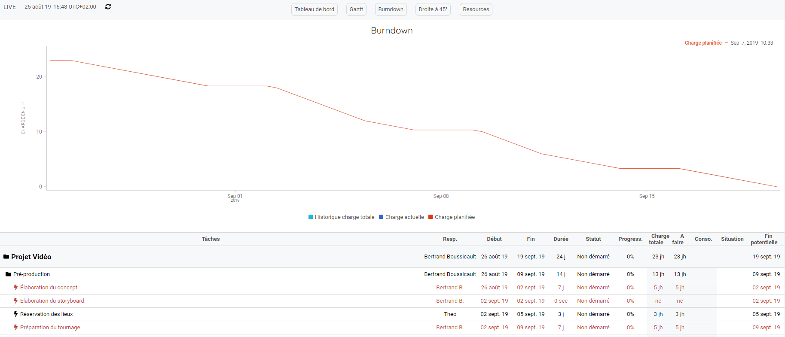
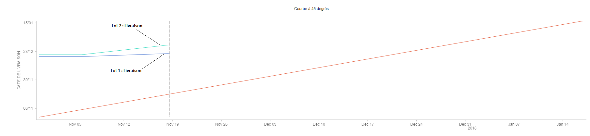
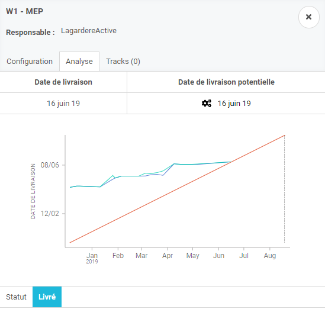

Chez Weelgo, nous estimons que le manageur doit se concentrer sur l'essentiel, c'est à dire le management des hommes, la gestion des problèmes et des arbitrages. Le temps passé à généré des plannings et des indicateurs ne doit plus être à la charge du manageur. C'est pourquoi la solution Weelgo générère automatiquement l'ensemble des outils permettant de piloter le projet. 

Analysons maintenant ces outils de pilotage. 

### Prendre des snapshots
------------------------

Afin de générer correctement les indicateurs de pilotage, il est important de prendre régulièrement des snapshots de vos projets. 

Pour cela, cliquez sur le bouton "Snaphot".

Puis sur le bouton  .

---
**Nos préconisations :**

>Faites un snapshot juste après l'initalisation du projet puis 1 fois par semaine. Cela permet d'avoir un bon suivi de l'avancement du projet. 

---

### Le Dashboard
------------------------

Le Dashboard est le tableau de bord du projet. Cette vue permet d'avoir une vision 360 du projet et de l'ensemble des indicateurs clés: 
+ Les jalons
+ Les problèmes

---

**Nos préconisations :**

>Le tableau de bord est idéal dans la communication de l'avancement du projet. Notammement dans une relation client / fournisseur. Vous pouvez communiquer sur l'avancement des livrables-jalons, clés du projet et de la santé du projet.

---

### Le Gantt
------------------------

Principal outil du pilotage de projet. Le gantt Weelgo regroupe les indicateurs nécessaires afin de prendre des décisions et des arbitrages. 

### Le Burndown
------------------------

Représentation graphique de l'évolution de la quantité de travail restante par rapport au temps. 

---
**Nos préconisations :**

>Attention, une consommation en dessous de la consommation idéale n'est pas forcement preuve de la bonne santé du projet. Seul l'avancement dans le gantt vous le garantira.

---

### La droite à 45°
------------------------

Représentation graphique de l'évolution des dates de fin prévisionnelles des jalons du projet. La droite à 45° vous permet de savoir, en un coup d'oeil, l'évolution des différentes dates de livraison prévues. 

La droite à 45° est un puissant outil de détection des dérives et de reporting de projet. 

Remarque : La droite à 45° ci-dessous montre la date de fin prévue pour les livraions du lot1 et du lot2. Nous remarquons ici que la courbe augmente, ce qui indique un retard sur les livraisons des lots. Lorsque la courbe diminue, cela indique de l'avance sur les dates prévues initialement. 

---
**Nos préconisations :**

>Chaque livrable / jalon à sa propre droite à 45°. Cette droite est accesible en cliquant sur le jalon depuis la vue dashboard puis sur l'onglet "Analyse".

---
