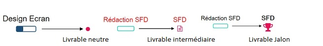
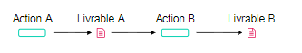
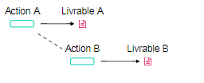
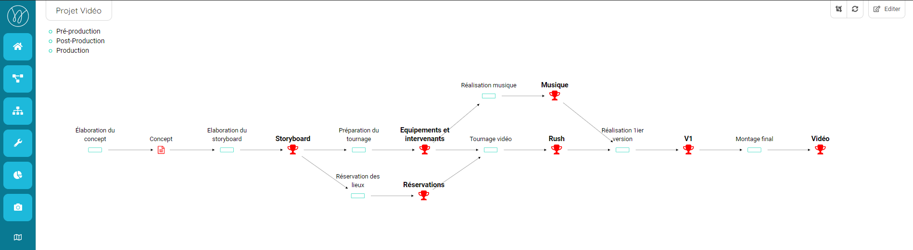
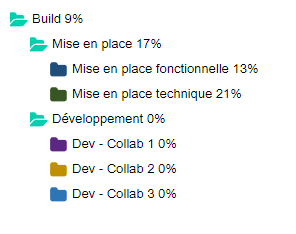
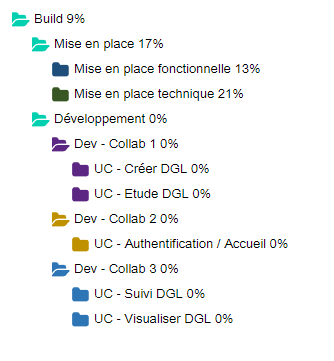
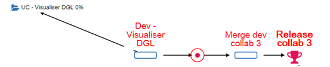

## Modélisez le projet
------------------------

Ce tutoriel s'adresse aux personnes souhaitant modéliser un projet sous Weelgo. Au travers de ce tutoriel, nous vous rappelerons certains grands principes de gestion de projet. Nous vous fournirons aussi une méthodologie vous permettant de structurer et démarrer votre projet en toute maîtrise ! 

La modélisation d'un projet Weelgo correspond à : 
* La définition des actions et des livrables
* L'odonnancement des actions 
* La définition des répertoires

 

*Vue Weelgo : Réseau*

### Définition des actions et des livrables
------------------------

Un projet est un enchaînement d'actions aboutissant à un ou plusieurs livrables. La modélisation du projet consiste donc à : 
* Déterminer l'ensemble des livrables constituant le projet
* Déterminer les actions permettant d'aboutir à ces livrables

Cette succession d'actions / livrables fomera votre réseau. Le réseau étant la colonne vertébrale de votre projet.

Ces livrables peuvent être de 3 types. Des livrables neutres, intermédiaires ou de type jalon 

Les livrables jalons sont des livrables que vous souhaitez suivre. Ils apparaîtront dans le tableau de bord du projet et bénéficieront d'un suivi particulier. 

Pour chaque action, il est nécessaire de se poser les questions suivantes :
* Que dois-je faire pour réaliser cette action? 
* Quels sont les inputs nécessaires à la réalisation de cette action? 
* Qu'ai-je en sortie de mon action ? 

Gardez en mémoire que vous avez la possibilité de créer des tickets dans "Actions" (depuis la vue Organisation). Un choix structurel s'impose donc. Dois-je créer une action ou un ticket? 

Pour vous aidez dans votre choix, souvenez-vous que le réseau doit matérialiser la structure de votre projet. Notamment avec la liste des livrables et des jalons. Si le résultat du ticket et un livrable de haute importante (application, documentation...), une action est préférable. Dans le cas contraire, privilégiez le ticket.

---

**Nos préconisations :**
 
>*Le réseau doit être structuré par des actions fournissant des livrables clés. Une action n'aboutissant pas à un livrable de haute importance doit plutôt être traitée comme un ticket (depuis la vue Organisation).*

**Points importants :**

>*Une action doit forcement aboutir à un livrable ou plusieurs livrables. Une action n'aboutissant à aucun résultat (livrable) ne doit pas être présente dans le réseau.*

---

### Ordonnancement des actions
------------------------

L'ordonnancement  permet de mettre en ordre l'ensemble des actions. Nous déterminons ainsi les dépendances entre chaque action et leur chronologie.

La solution Weelgo propose 2 types d'ordonnancements: L'ordonnancement "physique" et l'ordonnancement "temporel". 

L'ordonnancement "physique" est le lien entre 2 actions reliées par un livrable. L'action B attendant le livrable de l'action A afin de commencer.

L'ordonnancement "temporel" correspond à une dépendance temporelle entre 2 actions. L'action B ne pouvant commencer uniquement quand l'action A est terminée. Néanmoins, le livrable de l'action A n'est pas nécessaire à la réalisation de l'action B.

Dans Weelgo, la définition des actions et l'ordonnancement s'effectuent en même temps. En effet, lors de la modélisation de votre projet, vous allez naturellement enchaîner les actions / livrables pour aboutir au résultat final.  

Lors de la création du réseau, il est nécessaire de considérer les ressources comme infinies. Cela vous permettra de connaître le délai minimum possible.

---

**Nos préconisations :**
 
>*Ordonnancez votre projet sans prendre en compte les ressources (ressources infinies). Vous connaîtrez ainsi le délai minimum de réalisation de votre projet et vous pourrez déterminer le nombre maximum de personne pouvant être affecté sur votre projet.*

---

### Définition des répertoires 
------------------------

Suite à la création du réseau, il est nécessaire de finaliser sa construction en le structurant. Cette structure, ou découpage, permettra de faciliter la compréhension et la gestion au quotidien du projet.

De nombreux critères peuvent être utilisés pour effectuer ce découpage : 

* Fonctionnalités (mesurer, asservir)
* Sous-ensembles physiques (boitier A , boitier B) 
* Responsabilités industrielles (sous-traitant X, service Y) 
* Types de tâches (étude, réalisation) 
* Spécialités techniques (mécanique, logiciel) 
* Ressources (ingénieurs, techniciens, outillages) 
* Coûts (devis 1, achat K, sous-traitance X) 
* Maintenance (éléments échangeables, ordre du démontage) 
* Documentation (spécifications, dossiers, procédures)

Ce découpage est matérialisé par la création de répertoires et de sous-répertoires dans la vue "Réseau".

Nous retrouvons ici deux types de découpages. Un premier découpage de haut niveau correspondant à un découpage par phase (mise en place, développement), et un découpage par ressource au niveau de la phase de développement. 

Il est possible de descendre de niveau si nous estimons cela nécessaire.  Ici nous avons, pour chaque ressource, effectué un découpage fonctionnel. 

Ces répertoires contiendront les différentes actions nécessaires à la réalisation de votre projet. 

Cette architecture permet, d'avoir une vision globale de la réalisation du projet. Bien évidemment, il est possible de modifier l'affectation du découpage fonctionnelle en fonction des contraintes rencontrées lors de la réalisation du projet. 

Pour affecter des actions à un répertoire, il suffit de sélectionner les actions et tracer un trait vers le répertoire souhaité. 

---
 
**Nos préconisations :**

>*Effectuez des découpages simples. Au plus proche de la réalité. Des découpages complexes peuvent compliquer la gestion de votre projet.*

---
