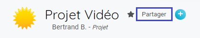
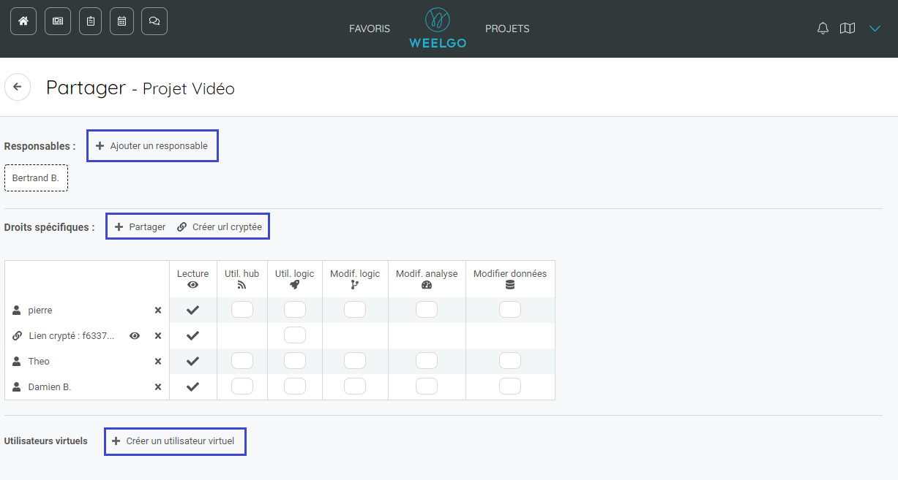
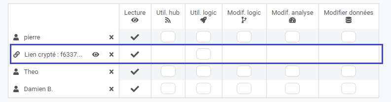
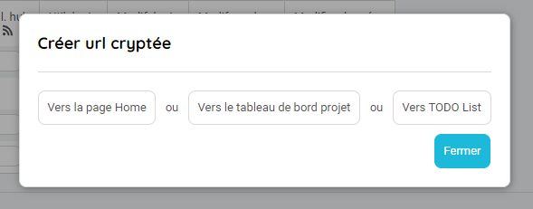

Vous avez modélisé et initialisé votre projet. Un planning est généré et vous souhaitez maintenant partager le projet à vos collaborateurs. 

Pour cela, cliquez sur le bouton partagez depuis la page principal du projet

Une fois sur la page de partage vous pouvez :
* Ajouter un responsable au projet
* Partager le projet à des collaborateurs
* Générer des URL Cryptées
* Créer des utilisateurs virtuels

## Partagez un projet. 
------------------------

L'ajout d'un responsable permet de définir un nouveau responsable sur le projet. Il aura les droits en lecture/écriture sur l'ensemble du projet. Il pourra aussi inviter sur supprimer des collaborateurs de la liste de partage. 

Une fois le projet partagé, vous avez la possibilité de définir les actions que vous souhaitez qu'il puisse faire.  

* Util. Hub : Permet uniquement à l'utilisateur d'utiliser le forum. Il peut ajouter, supprimer et répondre dans les tracks.
* Util. logic : Permet à l'utilisateur de modifier et d'indiquer son avancement dans la todo-list.
* Modif. Logic : Donne les droits en lecture / écriture sur le réseau du projet.
* Modif. analyse : Donne les droits de modifier la configuration du projet, les calendriers des collaborateurs et de faire des snapshots. Pour les roadmaps, cela permet en plus de modifier les templates de reporting et le journal de bord.
* Modifier données : 

## Les URL cryptée

Depuis l'écran de partage, vous pouvez créer une url cryptée. 

Cette url cryptée vous permettra de partager le projet à des personnes qui ne sont pas dans le projet ni dans Weelgo. 

Plusieurs partage sont possibles :

* Vers la home page : L'utilisateur aura accès à l'ensemble du projet. 
* Vers le tableau de bord projet : L'utilisateur aura accès uniquement aux indicateurs de pilotage du projet
* Vers la todo-list : L'utilisateur aura accès uniquement à la todo-list du projet

Si vous cochez la case "Util Logic.", vous permettez à l'utilisateur de modifier l'avancement des actions du projet. 

---

**Tips&Astuces :**

>*Le partage par URL crypté, avec le droit de modifier l'avancement du projet, vous permet  d'inclure des collaborateurs externes dans la réalisation de vos projets même si ils n'ont pas de compte Weelgo. .*

---
